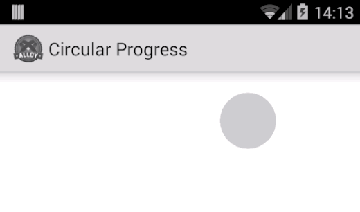

# CircularProgressbar [](http://www.appcelerator.com/titanium/) [](http://www.appcelerator.com/alloy/)

Alloy Widget for creating a circular progressbar.



## Quick Start

### Installation [](http://gitt.io/component/de.manumaticx.circularprogress)
Download the latest distribution ZIP-file and consult the [Titanium Documentation](http://docs.appcelerator.com/titanium/latest/#!/guide/Using_a_Module) on how install it, or simply use the [gitTio CLI](http://gitt.io/cli):

`$ gittio install de.manumaticx.circularprogress`

### Usage

create in xml
```xml
<Alloy>
	<Window class="container">
		<Widget src="de.manumaticx.circularprogress" id="progress" />
	</Window>
</Alloy>
```

style in tss
```javascript
".container": {
	backgroundColor:"#fff"
},
"#progress" : {
	margin:4,
	backgroundColor:'#fff',
	progressColor:'#33b5e5',
	progressBackgroundColor:'#333',
	progressWidth: 5,
	showText: true,
	color: '#33b5e5',
	font: {
		fontSize: 26,
		fontFamily: 'Roboto Condensed'
	}
}

```

update in controller
```javascript
// either: step-by-step update with setValue
function fakeProgress(){
    var val = 0;
    var pInterval = setInterval(function(){
        $.progress.setValue(++val);
        if (val >= 100) clearInterval(pInterval);
    }, 30);
}

// this is how you customize the value text
$.progress.formatValue = function(val){ return (val / 100 * 360) + '°'};

// or: to specific value at once with animation (does not work on iOS)
$.progress.animate({
	value: 75,
	duration: 500
});
```

## Credits

* Malcolm Hollingsworth (for his [excellent description](http://developer.appcelerator.com/question/154274/is-there-a-way-to-create-circular-progress-bar#answer-265134))
* Ronnie Swietek and Yaron Budowski (for Android [workaround](http://developer.appcelerator.com/question/154274/is-there-a-way-to-create-circular-progress-bar#answer-276757))

## License

    The MIT License (MIT)

    Copyright (c) 2014 Manuel Lehner

    Permission is hereby granted, free of charge, to any person obtaining a copy
    of this software and associated documentation files (the "Software"), to deal
    in the Software without restriction, including without limitation the rights
    to use, copy, modify, merge, publish, distribute, sublicense, and/or sell
    copies of the Software, and to permit persons to whom the Software is
    furnished to do so, subject to the following conditions:

    The above copyright notice and this permission notice shall be included in
    all copies or substantial portions of the Software.

    THE SOFTWARE IS PROVIDED "AS IS", WITHOUT WARRANTY OF ANY KIND, EXPRESS OR
    IMPLIED, INCLUDING BUT NOT LIMITED TO THE WARRANTIES OF MERCHANTABILITY,
    FITNESS FOR A PARTICULAR PURPOSE AND NONINFRINGEMENT. IN NO EVENT SHALL THE
    AUTHORS OR COPYRIGHT HOLDERS BE LIABLE FOR ANY CLAIM, DAMAGES OR OTHER
    LIABILITY, WHETHER IN AN ACTION OF CONTRACT, TORT OR OTHERWISE, ARISING FROM,
    OUT OF OR IN CONNECTION WITH THE SOFTWARE OR THE USE OR OTHER DEALINGS IN
    THE SOFTWARE.
